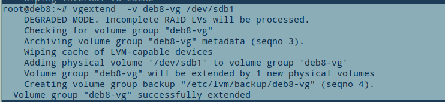

# Add Space to LVM Hardisk
this example using virtualbox to demonstrate step  
the main is to add new partition to lvm linux, expand the size so the partition become one greater partition

this using debian 8, with lvm default in installation

## 0. Add new Disk to VM or Physical Computer


## 1. fdisk show new disk
this show  the new pyhsical disk read by computer  
```` 
$ fdisk -l 
````


## 2. fdisk create new partition
create new partition in /dev/sdb   
```` 
$ fdisk /dev/sdb
...
Command (m for help ): n
...
Select (default p): p
...
Partition Number (1-4, default 1): 1
First Sector ...: (Just Press Enter)
Last Sector  ...: (Just Press Enter)
...
Command (m for help ): t
Selected partition 1
Hex code ...: 8e
...
Command (m for help ): w

````


## 3. show new partition
show all partition in /dev/sd*   
```` 
$ ls -l /dev/sd*
````


## 4. create new physical volume
change /dev/sdb1 to physical volume  
```` 
$ pvcreate /dev/sdb1
````


## 5. show physical volume
show all physical volume had create before   
```` 
$ pvdisplay
````


## 6. show volume group before
get the value  
VG Name **deb8-vg**  
VG Size **29.76 GB**  
Alloc PE **7618/29.76 GB**
Free PE **0 / 0**
```` 
$ vgdisplay
````


## 7. add partition /dev/sdb1 to Volume Group deb8-vg
show all partition in /dev/sd*   
```` 
$ vgextend -v deb8-vg /dev/sdb1
````


## 8. show volume group after vgextend
get the new value  
VG Name **deb8-vg**  
VG Size **59.75 GB**  
Alloc PE **7618/29.76 GB**  
Free PE **7679 / 30.00 GB**

```` 
$ vgdisplay
````


## 9. get LV Path to add the space
get the value
LV Path **/dev/deb8-vg/root**
we will add space to this logical volume
```` 
$ lvdisplay
````


## 10. see the space before
value Size from /dev/dm-0 **28 GB**
```` 
$ df -h
````


## 11 add the free space
add the new space, value ``+7679`` get from **Free PE** in step ``8``
```` 
$ lvextend -l +7679 -v /dev/deb8-vg/root
````


## 12 show new size
the new Size add 30 GB become ``58GB`` 
```` 
$ df -h
````
